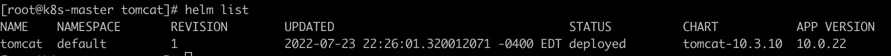
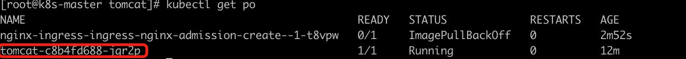
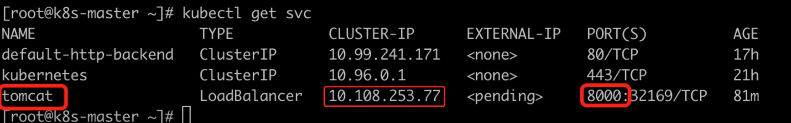
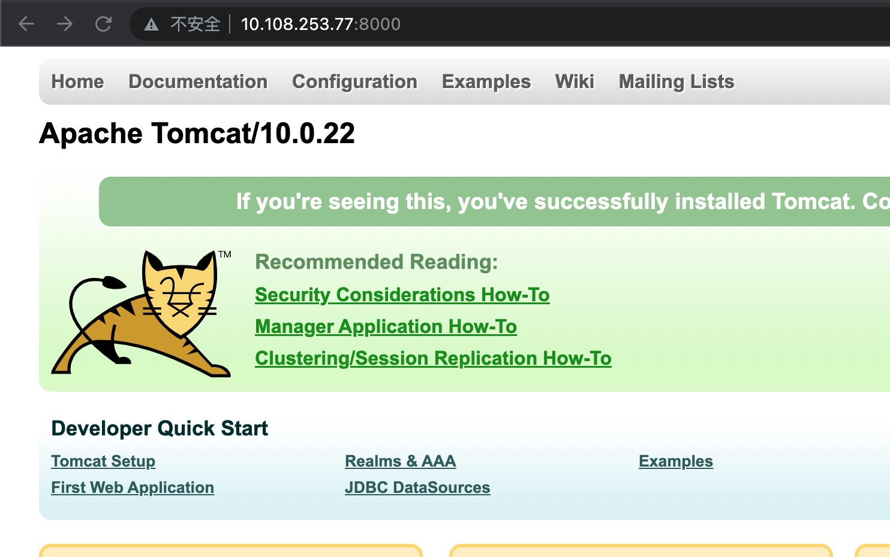
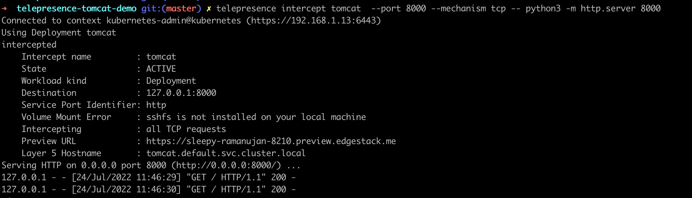
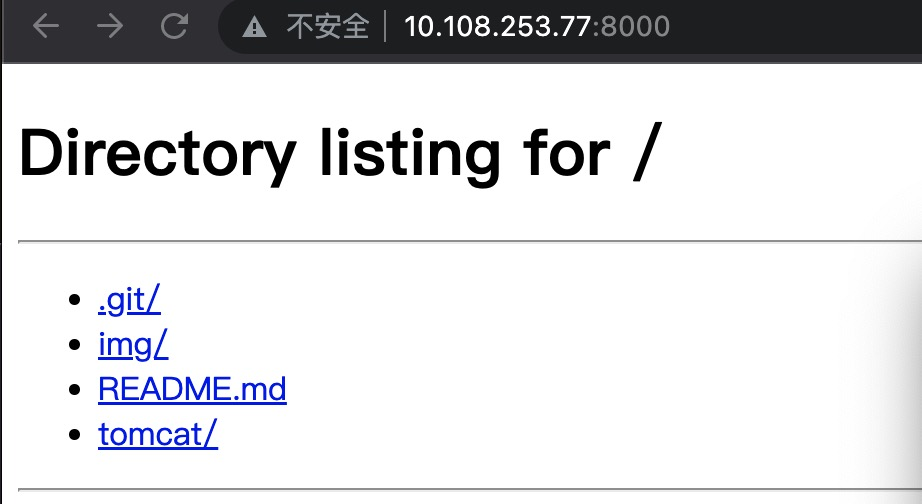

# enviroment
## kubernate
```
k8s-master  192.168.1.13
k8s-worker1 192.168.1.12
k8s-worker2 192.168.1.11
```

## local-computer
```
mac os
```

## WorkFlow

### step1. k8s install tomcat
```
# master server
cd tomcat
helm install tomcat .

# check helm deploy 
helm list

```




```

# make sure tomcat deploy state
watch -n 1 kubectl get pod 
```


### step2. mac os

#### step2-1. install telepresence 
```
# Intel Macs

# Install via brew:
brew install datawire/blackbird/telepresence

# OR install manually:
# 1. Download the latest binary (~60 MB):
sudo curl -fL https://app.getambassador.io/download/tel2/darwin/amd64/latest/telepresence -o /usr/local/bin/telepresence

# 2. Make the binary executable:
sudo chmod a+x /usr/local/bin/telepresence

# Apple silicon Macs

# Install via brew:
brew install datawire/blackbird/telepresence-arm64

# OR Install manually:
# 1. Download the latest binary (~60 MB):
sudo curl -fL https://app.getambassador.io/download/tel2/darwin/arm64/latest/telepresence -o /usr/local/bin/telepresence

# 2. Make the binary executable:
sudo chmod a+x /usr/local/bin/telepresence
```

#### step2-2. telepresence proxy
```
scp root@k8s-master:~/.kube/config ~/.kube/config

telepresence connect 
telepresence test-vpn

kubectl get svc
``` 





```
telepresence intercept tomcat  --port 8000 --mechanism tcp -- python3 -m http.server 8000
```


